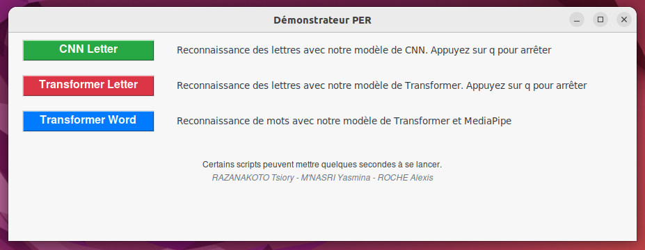
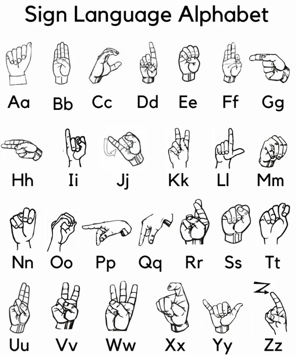

# Démonstrateur de Traduction de la Langue des Signes

Ce dépôt contient le démonstrateur développé dans le cadre de notre Projet d'Étude et de Recherche (PER) sur la traduction de la langue des signes. Ce projet vise à utiliser des techniques de vision par ordinateur et d'apprentissage profond pour reconnaître les lettres et mots de la langue des signes américaine (ASL) et les traduire en texte.

## Installation

Pour utiliser ce démonstrateur, suivez ces étapes :

1. Cloner le projet : ```git clone https://github.com/Roche-Alexis/PER-SD.git ```
2. Assurez-vous que vous avez Python installé sur votre système.
3. Installez les dépendances nécessaires en exécutant la commande suivante dans votre terminal :
   (Ajuster le préfixe "python" ou "python3" selon votre système pour effectuer ces commandes)


    ```bash
    python install.py
    ```
Si tkinter n'est pas installé d'office avec Python (comme sur les systèmes Debian) : 

 ```bash
sudo apt-get install python3-tk python3-pil.imagetk
 ```

## Exécution

Pour lancer le démonstrateur, exécutez cette commande dans votre terminal :

```bash
python run.py
 ```

Vous pouvez également lancer les scripts manuellement en se rendant dans le dossier ./code et en éxécutant le script voulu.





Nos 2 transformers pour les lettres peuvent classifier l'ensemble des lettres hormis le "J" et le "Z"
Notre modèle pour les mots peut différencier 3 mots : "yes", "no", "eat"



## Crédits

- RAZANAKOTO Tsiory
- M'NASRI Yasmina
- ROCHE Alexis
